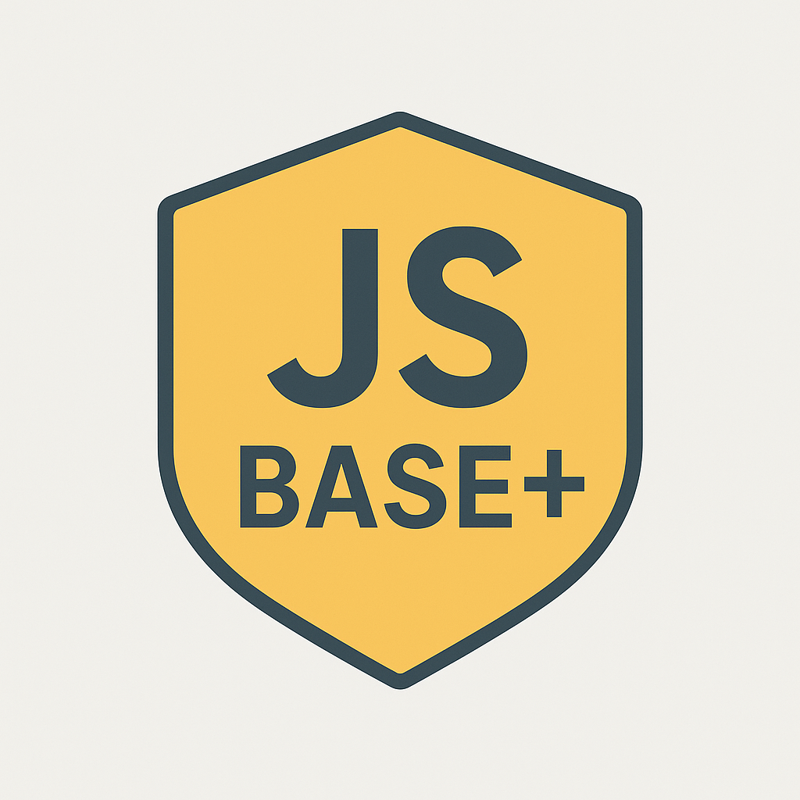

<table align="center" style="width:100%; border:0;">
  <tr>
    <td align="center" valign="middle" width="25%" style="font-size: 45px; font-weight: bold;">
      

        🌟 JS-BASE+  
        

         
        <em>Build real projects. Grow together. Launch careers.</em>
      

    </td>
    <td align="center" width="75%">
      
    </td>
  </tr>
</table>

---

### 🎯 Our Mission 
 
## **JS-BASE+ is about project-based set or reset through community collaboration.**

Whether you're a **student**, a **recent graduate**, a **self-taught developer**, or someone who’s been **recently laid off**, you’re likely facing a frustrating loop:

> _No experience, no job — no job, no experience._

Or maybe you're stuck with:

> _No network, no visibility — no visibility, no opportunity._

Whatever the case, many are left without meaningful employment or engagement in their field — even after doing everything "right."

**JS-Base+** was created to **break this cycle** and offer a solid, supportive foundation to **build from — not just wish for**.

We’re here to help you:
- ✅ Gain real-world experience through collaborative projects
- 🧑‍💻 Work in professional-like environments
- 💬 Expand your network with other motivated developers
- 🚀 Develop a portfolio that speaks louder than a resume
- 💡 Possibly co-found something bigger

You bring commitment and curiosity.  
We bring the platform, structure, and people.

Together, let’s **build, learn, and grow** — one project at a time.

---

## 🚀 What We Do

This GitHub organization is a **community-powered project hub**. Together, we:
- Design and develop projects from idea to prototype — and beyond
- Learn from one another in a professional setting
- Focus on **solid documentation** and clean code
- Build resumes that **show, not just tell**

All repositories are:
- 📂 **Open from early setup and planning**
- 🛠️ Evolving through public collaboration
- 📌 Built beyond MVPs, as logistics and contributors allow
- 🧾 **Satisfactorily documented** and transparently managed

---

## 👥 Who Should Join?

- 📚 Students & new grads seeking experience
- 💻 Self-taught developers looking for credibility
- 🛠️ Hobbyists ready to turn skills into impact
- 💼 Recently laid-off professionals rebuilding
- 🌍 Anyone excited about **collaborative software development**

---

## 💡 Propose a New Project

Do you have an idea you'd love to see take shape? Here's how to get it into motion:

### 🗂️ Submission Process

1. **Fork** the [`jsb-AddProject`](https://github.com/JS-Base/jsb-AddProject) repository.
2. In your fork, create a **new, well-named folder** for your project idea.
3. Add **preliminary documentation** in that folder:
   - Overview of the idea
   - Intended users
   - Proposed tech stack
   - Key features for an MVP
4. Submit a **Pull Request** to the original `jsb-AddProject`, referencing the folder and including a clear PR message.

---

### ✅ If the Project Is Accepted:

- An **admin will create a dedicated repository** for the project
- The idea folder will be removed from `jsb-AddProject`
- Documentation can then be **expanded collaboratively**
- A **GitHub Project Kanban board** will be created for task tracking
- The repo will be open to **all contributors from early setup and planning through to MVP and beyond**
- Development continues **as resources and logistics allow**, with no strict MVP cutoff

---

### ❌ If the Project Is Not Accepted:

We’ll **clearly explain why** in a comment:
- Maybe it needs refining
- Maybe it's out of scope
- Either way, you'll get feedback and the chance to revise

---

## 📌 Active Project Policy

We will only take on **as many active projects as we have contributors for**. This ensures:
- Quality collaboration
- Consistent progress
- Sustainable contributor energy

---

## 📣 Communication & Collaboration

- All current communication will happen **on GitHub**
- Issues, discussions, pull requests, and project boards are our main tools
- In the future, we aim to build an **in-house collaboration platform** tightly integrated with workflows

---

## 📘 Documentation Commitment

Every project under JS-Base+ will be:
- **Thoroughly documented** from day one
- Kept up-to-date through all stages of development
- Ready for others to understand, contribute to, or even showcase

---

## 🧠 Suggest Workflows & Improvements

We're building this platform **together**.

If you have ideas on:
- Better ways to manage collaboration
- New features for contributor experience
- Improvements to workflows or documentation practices

…**we want to hear from you**!

👉 Use the same process as project ideas:
1. Fork `jsb-AddProject`
2. Create a **well-named folder** for your suggestion
3. Add a `README.md` with your proposed improvement or workflow
4. Submit a **Pull Request**

All serious suggestions will be **reviewed and discussed**, just like projects.  
From day one, **we all have a say** in what happens here.

---

## 🤝 Let’s Build Something Great!

> Contribute. Collaborate. Get noticed. Grow.

Whether you're here to gain experience, explore tech ideas, or build the next big thing — welcome aboard.

> _“Opportunities multiply as they are seized.”_ – Sun Tzu

---
